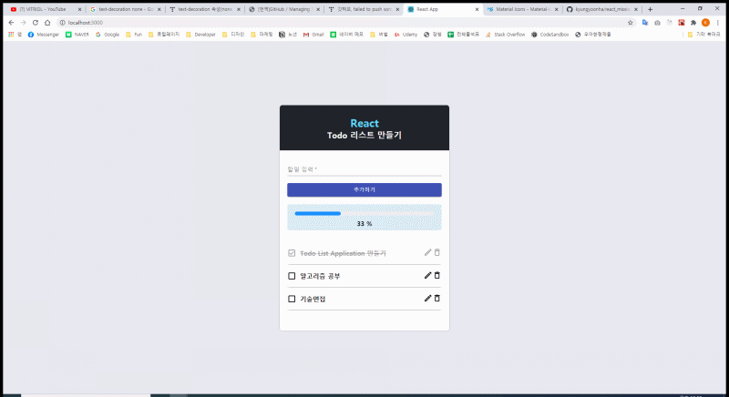

## 미션1 Todo List 만들기

1. App.js는 todos 데이터 / onremove(), ontoggle(), onEdit()을 가진다
2. 클릭이 발생하면 ontoggle 이벤트 발생 -> 해당 글자를 ontoggle의 인자로 넘긴다.
3. app.js에 정의된 ontoggle(text)인자로 넘어와서 그 값을 인풋 박스의 props로 내려준다.
4. 인붓 박스는 부모가 물려준 글자를 받아서 인붓박스의 디폴트 value로 세팅한다.
5. 수정완료 버튼 액션은 app.js가 물려준 onEdit()함수를 인풋박스의 값으로 인자 넣어서 호출한다.

.
